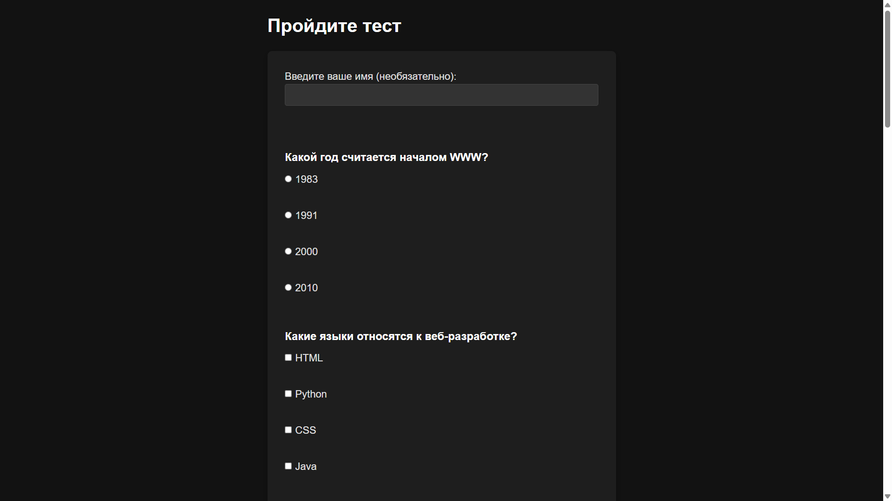

# README: Веб-приложение для создания и прохождения тестов

## 1. Инструкции по запуску проекта

### Требования:

- PHP 7.4+ (рекомендуется PHP 8+)
- Веб-сервер (Встроенный сервер PHP)
- Браузер для прохождения тестов

### Запуск PHP сервера:

1. Клонируйте репозиторий или скопируйте файлы проекта в рабочую директорию.
2. Откройте терминал и перейдите в папку с проектом.
3. Запустите сервер командой:
    
    ```sh
    php -S localhost:3000
    ```
    
4. Откройте в браузере `http://localhost:3000/index.php`.

---

## 2. Краткое описание функционала приложения

- Пользователь может пройти тест анонимно или указав имя.
- Вопросы загружаются из файла `data/questions.json`.
- Поддерживаются два типа вопросов:
    - Один правильный ответ (`radio`)
    - Несколько правильных ответов (`checkbox`)
- После завершения теста пользователь видит:
    - Количество правильных ответов
    - Процент набранных баллов
- Результаты сохраняются и отображаются на странице `/dashboard.php`.

---

## 3. Примеры тестов (из файла `data/questions.json`)

```json
[
    {
        "question": "Какой год считается началом WWW?",
        "answers": ["1983", "1991", "2000", "2010"],
        "correct": [1],
        "type": "single"
    },
    {
        "question": "Какие языки относятся к веб-разработке?",
        "answers": ["HTML", "Python", "CSS", "Java"],
        "correct": [0, 2],
        "type": "multiple"
    }
]
```

---

## 4. Структура базы данных или файла

Приложение использует JSON-файл для хранения тестов (`data/questions.json`). Структура файла:

```json
[
    {
        "question": "Текст вопроса",
        "answers": ["Вариант 1", "Вариант 2", "Вариант 3"],
        "correct": [0, 2],
        "type": "multiple"
    }
]
```

Результаты тестов сохраняются в `data/results.json` в формате:

```json
[
    {
        "username": "Имя",
        "score": 80,
    }
]
```

---

## 5. Скриншоты работы приложения

index.php

test.php

result.php

dashboard.php
